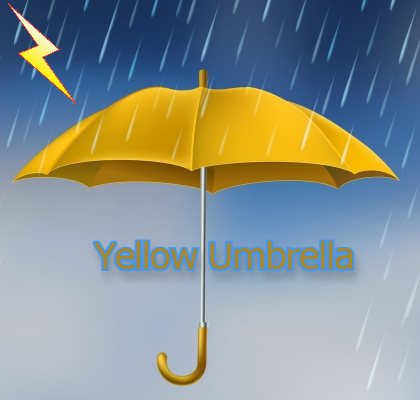

# Weather Station

## an IoT project

### Development Roadmap

- [x] Setup repos - GitHub
- [x] setup ESP32 - Arduino IDE
- [x] Install dependencies - aREST.h and DHT.h
- [x] Test ESP32 - get json data via wifi
- [x] Initialize Node.js environment
- [x] setup server.js with express
- [ ] set index route and views
- [ ] link ESP32 to Node app with fetch

### Initializing a Node.js Environment

1. Ensure that Node.js and NPM are installed on your system:
    > node --version

    > npm --version

2. In terminal, inside the project directory:
    > npm init -y

3. This will add a package.json file

4. Install dependencies
    > npm install express ejs express-ejs-layouts

5. Install development dependencies
    > npm install --save-dev dotenv nodemon

### Initializing a Node.js Environment

1. Ensure that Node.js and NPM are installed on your system:
    > node --version

    > npm --version

2. In terminal, inside the project directory:
    > npm init -y

3. This will add a package.json file

4. Install dependencies
    > npm install express ejs express-ejs-layouts

5. Install development dependencies
    > npm install --save-dev dotenv nodemon

### Worklog and Commits

Date | Commit Message | Version
:-----|:----------------:|:--------:
25.08.23 | initial setup | 0.1.0

### References

- [Web Page Layouts](https://www.youtube.com/watch?v=3C_22eBWpjg)
- [JS Native Fetch](https://www.youtube.com/watch?v=MBqS1kYzwTc)
- [Callum Bennett](https://www.youtube.com/watch?v=dQw4w9WgXcQ)

### Extra notes

- The ESP32 connects with the ws-dht11 to create a functioning station
- During the development process I ran into two difficulties.
- The first one was when my computer didn't charge properly and just displayed a very dim version of the Windows loading screen (I thought I broke it)
- The second one was when I accidentaly put my pins in the wrong holes and thought there was an error with the code
- I made changes to the look of the website while making it ever so slightly more functional and cooler looking
- I attempted to add more functionality to the ESP32 board without success
- The main challenge in this assignment was figuring what all the code I had been given actually did
- The easiest part of this assignment was when I asked my brother for help (See references)