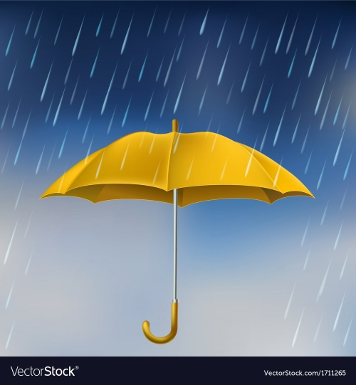

# Weather Station

## an IoT project

### Development Roadmap

- [x] Setup repos - GitHub
- [x] setup ESP32 - Arduino IDE
- [x] Install dependencies - aREST.h and DHT.h
- [ ] Test ESP32 - get json data via wifi
- [ ] Initialize Node.js environment
- [ ] setup server.js with express
- [ ] set routes
- [ ] create frontend views

### Worklog and Commits

Date | Commit Message | Version
:-----|:----------------:|:--------:
25.08.23 | initial setup | 0.1.0

### References

- [Web Page Layouts](https://www.youtube.com/watch?v=3C_22eBWpjg)
- [JS Native Fetch](https://www.youtube.com/watch?v=MBqS1kYzwTc)
